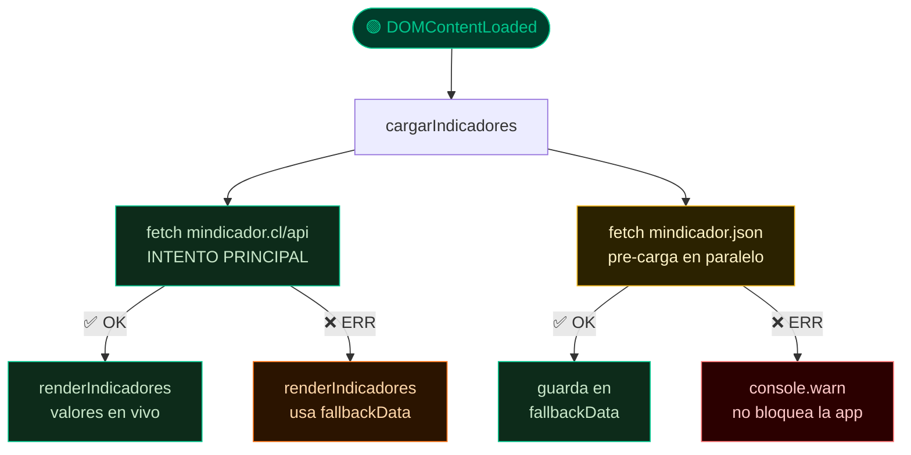
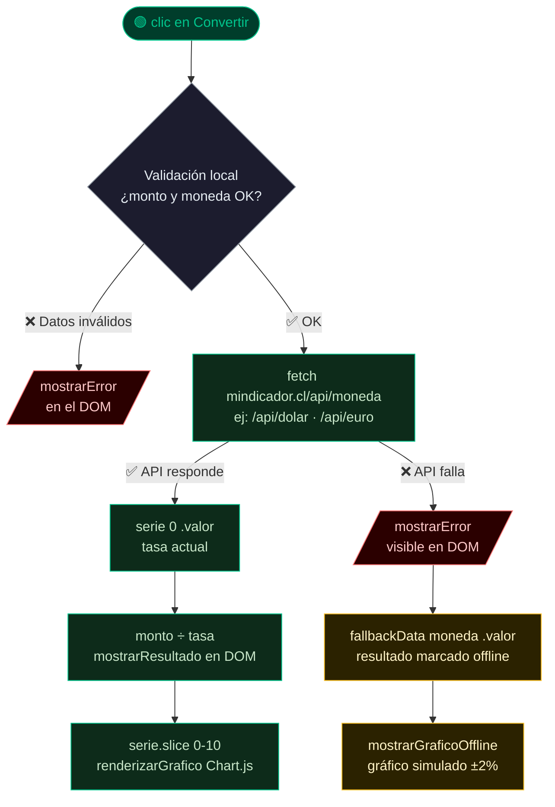

# CambioClaro — Conversor de Monedas Nacional

> Prueba técnica Desafío Latam · Fetch API + Chart.js + Bootstrap 5

---

## 📁 Estructura del proyecto

```
📁 conversor/
├── 🌐 index.html        → Estructura HTML + Bootstrap 5
├── 🎨 styles.css        → Estilos dark mode + animaciones
├── ⚙️  app.js            → Lógica JS: fetch, conversión, gráfico
└── 🔒 mindicador.json   → Respaldo offline (solo si la API falla)
```

---

## 🔄 Flujo 1 — Carga de la página

> La app **siempre intenta la API real primero**. El JSON offline solo se activa si la API no responde.



---

## 🔄 Flujo 2 — Botón "Convertir"



---

## 🔒 Cuándo se usa `mindicador.json`

| Situación | Función | Resultado visible |
|-----------|---------|------------------|
| API caída al **cargar** | `cargarIndicadores()` | Tarjetas con valores del JSON |
| API caída al **convertir** | `btnBuscar` handler | Error en pantalla + resultado `(offline)` |

> En ambos casos el usuario ve claramente que los datos no son en tiempo real.

---

## 🛡️ Manejo de errores — `try / catch`

| Función | Captura | Muestra al usuario |
|---|---|---|
| `cargarFallback()` | JSON no encontrado | Solo `console.warn`, no interrumpe |
| `cargarIndicadores()` | API caída, HTTP error | Activa respaldo silenciosamente |
| `btnBuscar` handler | API caída, HTTP error, serie vacía | `#errorBox` visible + resultado offline |

---

## 🧮 Fórmula de conversión

$$resultado = \frac{monto_{CLP}}{tasa_{CLP}}$$

**Ejemplo:** `200.000 CLP ÷ 5,56 = 35.971,22 lb/cobre`

---

## 💱 Monedas soportadas

| Select | Nombre | Endpoint | Unidad |
|--------|--------|----------|--------|
| `dolar` | Dólar observado | `/api/dolar` | USD |
| `euro` | Euro | `/api/euro` | EUR |
| `uf` | Unidad de Fomento | `/api/uf` | UF |
| `utm` | UTM | `/api/utm` | UTM |
| `bitcoin` | Bitcoin | `/api/bitcoin` | BTC |
| `libra_cobre` | Libra de Cobre | `/api/libra_cobre` | lb/cobre |

---

## 📦 Dependencias externas (CDN)

| Librería | Versión | Uso |
|----------|---------|-----|
| Bootstrap | `5.3.2` | Layout, grid, componentes UI |
| Bootstrap Icons | `1.11.3` | Íconos |
| Chart.js | `4.4.0` | Gráfico de línea con historial |
| Google Fonts | — | Syne (display) + DM Sans (body) |

---

## 📋 Requerimientos cubiertos

| # | Criterio | Puntos | Estado |
|---|----------|--------|--------|
| 1 | Tipos de cambio obtenidos desde `mindicador.cl` | 1 pto | ✅ |
| 2 | Conversión calculada y mostrada en el DOM | 3 ptos | ✅ |
| 3 | Select con 2+ monedas funcionando correctamente | 3 ptos | ✅ |
| 4 | `try/catch` en fetch con error visible en DOM | 2 ptos | ✅ |
| 5 | Gráfico con historial implementado | 1 pto | ✅ |
| | **Total** | **10 ptos** | 🎯 |